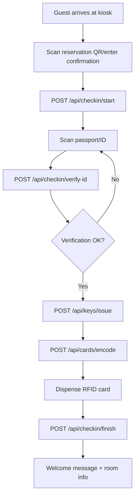
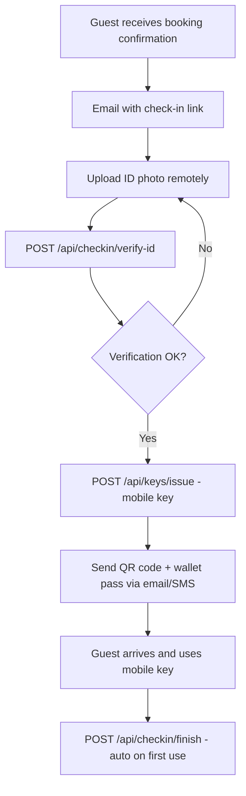

# 🔐 Trinity-TAJ Integration Guide

## Overview

Complete integration of Trinity-TAJ smart lock systems and self-service kiosks into the Vendoora Smart Hotel Experience Platform. This system supports both **traditional hospitality** (Hotel Lock & API) and **short-term rentals** (Smart Lock 2025 catalog).

---

## 📚 Source Documents

1. **Trinity-TAJ Smart Lock 2025.pdf**
   - Target: Airbnb, VRBO, Timeshare properties
   - Focus: Mobile keys, wallet passes, TTLock/Tuya app integration
   - Lock families: KL-series, S-series

2. **Trinity-TAJ Hotel Lock & API.pdf**
   - Target: Hotels, Resorts, Casinos, Motels
   - Focus: PMS integration, kiosk check-in, RFID card issuance
   - Lock families: L-series, KL-series
   - Kiosk integration specifications

---

## 🏗️ System Architecture

### Data Files

```
/public/data/
├── locks-trinity-taj.json       # Complete lock catalog with compatibility matrix
└── kiosks-trinity-taj.json      # Kiosk models with feature sets

/public/vendoora-assets/
└── images_4k/
    ├── kiosks/                  # Dual-finish kiosk renders (white/black)
    │   ├── kiosk_desktop19_white.png
    │   ├── kiosk_desktop19_black.png
    │   ├── kiosk_freestanding32_white.png
    │   ├── kiosk_freestanding32_black.png
    │   ├── kiosk_wall21_white.png
    │   └── kiosk_wall21_black.png
    └── locks/                   # Dual-finish lock renders (silver/black)
        ├── lock_slim_silver.png
        ├── lock_slim_black.png
        ├── lock_kl_silver.png
        ├── lock_kl_black.png
        ├── lock_s_series_silver.png
        └── lock_s_series_black.png
```

### API Endpoints

```
/api/checkin/start          # Initiate check-in session
/api/checkin/verify-id      # Verify guest identity
/api/keys/issue             # Issue digital/physical key
/api/cards/encode           # Encode RFID card
/api/keys/revoke            # Revoke key access
/api/checkin/finish         # Complete check-in process
```

### Components

```
/src/components/trinity-taj/
├── SmartHotelBuilder.tsx       # 5-step configuration wizard
└── CheckInFlowDemo.tsx         # API flow demonstration

/src/app/
├── trinity-taj-builder/        # Main builder page
└── checkin-flow-demo/          # API demo page
```

---

## 🔐 Lock Families

### TAJ L-Series (Hotel Lock)
**Audience**: Hotels, Resorts, Casinos, Motels  
**Power**: Battery or Wired  
**Auth Methods**: RFID Card, Mobile (BLE), PIN, Fingerprint  
**Features**:
- Mechanical key backup
- PMS-ready (ONITY, Saflok, etc.)
- Offline mode capable
- Slim European mortise design

**Kiosk Compatibility**:
- ✅ Desktop 19" - Card dispenser
- ✅ Freestanding 32" - Card dispenser
- ⚠️ Wall 21" - Mobile keys only (no card dispenser)

**Use Cases**:
- Traditional hotel check-in with RFID cards
- PMS integration for key issuance
- Front desk card encoding

---

### TAJ KL-Series (Camera Lock)
**Audience**: Hotels, Resorts, Timeshare, Airbnb, VRBO (universal)  
**Power**: Battery  
**Auth Methods**: RFID Card, Mobile (BLE), PIN, Fingerprint, Face Recognition  
**Features**:
- Built-in camera with video intercom
- Face recognition
- TTLock / Tuya app integration
- Advanced security features

**Kiosk Compatibility**:
- ✅ All kiosk models
- ✅ Mobile key QR codes
- ✅ Wallet pass issuance
- ✅ Card encoding (if kiosk has dispenser)

**Use Cases**:
- High-security properties
- Video verification at door
- Multi-auth flexibility

---

### TAJ S-Series (Slimline Lock)
**Audience**: Airbnb, VRBO, Timeshare, Serviced Apartments  
**Power**: Battery  
**Auth Methods**: Mobile (BLE), PIN, RFID Card  
**Features**:
- Wallet key support (Apple Wallet, Google Pay)
- Temporary access codes
- TTLock / Tuya app integration
- Slimline design for apartments

**Kiosk Compatibility**:
- ✅ Wall 21" - Optimal (mobile keys only)
- ✅ Desktop 19" - Mobile keys + QR
- ✅ Freestanding 32" - Mobile keys + QR

**Use Cases**:
- Short-term rentals
- Remote check-in (no physical kiosk)
- Mobile-first guest experience

---

## 🖥️ Kiosk Models

### Desktop 19" Kiosk
**Price**: $1,200  
**Form Factor**: Countertop  
**Features**:
- ✅ ID/Passport scanning (camera + OCR)
- ✅ Thermal receipt printer
- ✅ RFID card encoder & dispenser
- ✅ QR code printing
- ✅ EMV payment terminal (optional)

**Best For**: Hotels, motels with front desk space  
**Lock Compatibility**: TAJ L-series, KL-series

---

### Freestanding 32" Kiosk
**Price**: $2,500  
**Form Factor**: Floor-standing lobby unit  
**Features**:
- ✅ Large 32" touchscreen
- ✅ High-res camera (passport MRZ reading)
- ✅ Dual RFID card encoder & dispenser
- ✅ High-speed thermal printer
- ✅ EMV + NFC payment terminal
- ✅ ADA compliant

**Best For**: Hotel lobbies, resorts, high-traffic areas  
**Lock Compatibility**: All TAJ series

---

### Wall-Mounted 21" Kiosk
**Price**: $1,800  
**Form Factor**: Wall-mounted  
**Features**:
- ✅ ID/Passport scanning
- ✅ Thermal receipt printer
- ✅ QR code printing
- ⚠️ NO card dispenser (mobile keys only)

**Best For**: Boutique hotels, Airbnb properties, space-limited lobbies  
**Lock Compatibility**: TAJ KL-series, S-series (mobile keys)

---

## 🔄 Check-In Flow Sequence

### Standard Hotel Check-In (with Card Issuance)



### Short-Term Rental (Mobile Key Only)



---

## 🛠️ API Request/Response Examples

### 1. Start Check-In

**Request:**
```http
POST /api/checkin/start
Content-Type: application/json

{
  "reservationId": "RES-2025-001",
  "guest": {
    "name": "John Doe",
    "docType": "passport",
    "docScanId": "SCAN-001"
  },
  "kioskId": "KIOSK-LOBBY-01"
}
```

**Response:**
```json
{
  "success": true,
  "data": {
    "checkinId": "CHECKIN-ABC123",
    "verificationRequired": true,
    "verificationMethods": ["passport", "id", "face"],
    "estimatedTime": 5
  }
}
```

---

### 2. Verify ID

**Request:**
```http
POST /api/checkin/verify-id
Content-Type: application/json

{
  "checkinId": "CHECKIN-ABC123",
  "method": "passport",
  "result": "pass",
  "evidenceId": "EVIDENCE-001"
}
```

**Response:**
```json
{
  "success": true,
  "data": {
    "verified": true,
    "confidenceScore": 0.978,
    "nextStep": "issue_key"
  }
}
```

---

### 3. Issue Key

**Request:**
```http
POST /api/keys/issue
Content-Type: application/json

{
  "propertyId": "PROP-001",
  "unitId": "301",
  "guestId": "GUEST-001",
  "lockFamily": "TAJ-L-series",
  "auth": ["card", "mobile"],
  "validFrom": "2025-10-07T15:00:00Z",
  "validUntil": "2025-10-10T11:00:00Z",
  "channel": "kiosk"
}
```

**Response:**
```json
{
  "success": true,
  "data": {
    "keyId": "KEY-XYZ789",
    "type": "rfid",
    "vendorRef": "taj-l-series_1728298076235_abc123",
    "qrPayload": "{...}",
    "walletPassUrl": "https://vendoora.com/wallet/KEY-XYZ789",
    "expiresAt": "2025-10-10T11:00:00Z"
  }
}
```

---

### 4. Encode Card

**Request:**
```http
POST /api/cards/encode
Content-Type: application/json

{
  "keyId": "KEY-XYZ789",
  "kioskId": "KIOSK-LOBBY-01",
  "encoderId": "ENCODER-01"
}
```

**Response:**
```json
{
  "success": true,
  "data": {
    "status": "dispensed",
    "cardId": "CARD-123456",
    "message": "Card encoded and dispensed successfully"
  }
}
```

---

## 🔒 Compatibility Matrix

### Kiosk → Lock Compatibility

| Kiosk Model      | TAJ L-Series | TAJ KL-Series | TAJ S-Series |
|------------------|--------------|---------------|--------------|
| Desktop 19"      | ✅ Optimal   | ✅ Full       | ✅ Mobile    |
| Freestanding 32" | ✅ Optimal   | ✅ Optimal    | ✅ Mobile    |
| Wall 21"         | ⚠️ Mobile   | ✅ Mobile     | ✅ Optimal   |

**Legend**:
- ✅ **Optimal**: Can issue RFID cards + mobile keys
- ✅ **Full**: All features supported
- ✅ **Mobile**: Mobile keys only (no card dispenser)
- ⚠️ **Mobile**: Limited to mobile keys

---

### Property Type → Lock Recommendations

| Property Type    | Recommended Lock(s)     | Rationale                           |
|------------------|-------------------------|-------------------------------------|
| Hotel            | TAJ L-series, KL-series | PMS integration, card issuance      |
| Resort           | TAJ L-series, KL-series | High volume, multiple auth methods  |
| Casino           | TAJ L-series, KL-series | Security, audit trail, integration  |
| Motel            | TAJ L-series            | Cost-effective, card-based          |
| Airbnb           | TAJ S-series, KL-series | Mobile-first, wallet keys           |
| VRBO             | TAJ S-series, KL-series | Remote access, temporary codes      |
| Timeshare        | TAJ KL-series, S-series | Flexible auth, owner vs guest modes |
| Vacation Rental  | TAJ S-series            | Mobile keys, no front desk needed   |

---

## 🎯 Implementation Rules

### Automatic Compatibility Checks

1. **If kiosk has key-dispense capability**:
   - Enable RFID card encoding for TAJ L-series and KL-series
   - Require card encoder hardware
   - Default to card issuance for hotel properties

2. **If kiosk has QR printing**:
   - Enable mobile key issuance for KL-series and S-series
   - Generate QR codes and wallet passes
   - Recommended for Airbnb/VRBO properties

3. **If kiosk has ID/Passport scanning**:
   - Require verification before ANY credential issuance
   - Log verification evidence for compliance
   - Support passport MRZ reading

4. **Property type is Airbnb/VRBO/Timeshare**:
   - Default to TAJ S-series or KL-series
   - Disable physical card dispense by default
   - Enable mobile key workflows
   - Support temporary access codes

5. **Wired/online lock selected**:
   - Enable instant key revoke capability
   - Support real-time access logs
   - Allow remote lock/unlock from PMS

---

## 🔑 Key Issuance Matrix

### By Lock Family & Channel

| Lock Family   | RFID Card | Mobile Key | PIN Code | Fingerprint | Face ID |
|---------------|-----------|------------|----------|-------------|---------|
| TAJ L-series  | ✅        | ✅         | ✅       | ✅          | ❌      |
| TAJ KL-series | ✅        | ✅         | ✅       | ✅          | ✅      |
| TAJ S-series  | ⚠️        | ✅         | ✅       | ❌          | ❌      |

**Legend**:
- ✅ **Supported**: Fully supported and recommended
- ⚠️ **Limited**: Supported but not primary use case
- ❌ **Not Available**: Hardware does not support

---

## 🧪 Testing

### Test the Builder

1. Navigate to `/trinity-taj-builder`
2. Complete all 5 steps
3. Download configuration JSON
4. Verify property type → lock recommendations

### Test the API Flow

1. Navigate to `/checkin-flow-demo`
2. Click through each API step:
   - Start Check-In
   - Verify ID
   - Issue Key
   - Encode Card
   - Complete Check-In
3. Inspect network tab for API requests/responses
4. Verify mock data in responses

### Test API Endpoints Directly

```bash
# Start check-in
curl -X POST http://localhost:3000/api/checkin/start \
  -H "Content-Type: application/json" \
  -d '{"reservationId":"RES-001","guest":{"name":"Test"},"kioskId":"K1"}'

# Verify ID
curl -X POST http://localhost:3000/api/checkin/verify-id \
  -H "Content-Type: application/json" \
  -d '{"checkinId":"CHECKIN-001","method":"passport","result":"pass","evidenceId":"E1"}'

# Issue key
curl -X POST http://localhost:3000/api/keys/issue \
  -H "Content-Type: application/json" \
  -d '{"propertyId":"P1","unitId":"301","guestId":"G1","lockFamily":"TAJ-L-series","auth":["card"],"validFrom":"2025-10-07T15:00:00Z","validUntil":"2025-10-10T11:00:00Z","channel":"kiosk"}'

# Encode card
curl -X POST http://localhost:3000/api/cards/encode \
  -H "Content-Type: application/json" \
  -d '{"keyId":"KEY-001","kioskId":"K1","encoderId":"E1"}'

# Revoke key
curl -X POST http://localhost:3000/api/keys/revoke \
  -H "Content-Type: application/json" \
  -d '{"keyId":"KEY-001","reason":"guest-checkout"}'

# Finish check-in
curl -X POST http://localhost:3000/api/checkin/finish \
  -H "Content-Type: application/json" \
  -d '{"checkinId":"CHECKIN-001","keyId":"KEY-001"}'
```

---

## 🔌 Future Integration (TTLock/Tuya APIs)

When ready to connect to actual lock hardware:

### TTLock API Integration
```typescript
// Replace mock in /api/keys/issue/route.ts
import { TTLockAPI } from '@/lib/ttlock';

const ttlock = new TTLockAPI(process.env.TTLOCK_CLIENT_ID, process.env.TTLOCK_SECRET);

// Issue key via TTLock
const lockKey = await ttlock.createKey({
  lockId: lock.ttlockId,
  keyName: `Guest-${guestId}`,
  startDate: validFrom,
  endDate: validUntil,
  keyType: 'timed', // or 'permanent', 'erase'
});
```

### Tuya API Integration
```typescript
// Replace mock in /api/keys/issue/route.ts
import { TuyaAPI } from '@/lib/tuya';

const tuya = new TuyaAPI(process.env.TUYA_ACCESS_ID, process.env.TUYA_SECRET);

// Issue temporary password
const tempPassword = await tuya.createTempPassword({
  deviceId: lock.tuyaDeviceId,
  password: generateSecurePin(),
  effectiveTime: validFrom,
  invalidTime: validUntil,
  name: guestName,
});
```

---

## 📊 Analytics & Reporting

### Key Metrics to Track

1. **Check-In Performance**
   - Average check-in time
   - Verification success rate
   - Card dispense failures
   - API response times

2. **Lock Usage**
   - Keys issued per day/week/month
   - Auth method distribution (card vs mobile vs PIN)
   - Access attempts and denials
   - Key revocations and reasons

3. **Kiosk Performance**
   - Uptime and availability
   - Transaction success rate
   - Error rates by component
   - Maintenance alerts

---

## 🚨 Error Handling

### Common Error Scenarios

1. **ID Verification Fails**
   - Retry with different lighting
   - Offer manual verification at front desk
   - Log failed attempts for security

2. **Card Encoder Jam**
   - Alert maintenance
   - Offer mobile key as backup
   - Log hardware error

3. **Network Timeout**
   - Retry with exponential backoff
   - Fall back to offline mode (if supported)
   - Queue for sync when online

4. **Lock Not Responding**
   - Check battery level
   - Verify network connectivity (wired locks)
   - Issue backup mechanical key

---

## 🔐 Security Considerations

### Best Practices

1. **API Keys**: Store in environment variables, never commit to git
2. **Key Validity**: Always set expiration times
3. **Revocation**: Implement automatic revocation on checkout
4. **Audit Logging**: Log all key issuance and access attempts
5. **Encryption**: Encrypt key data in transit and at rest
6. **Compliance**: Follow PCI-DSS for payment data, GDPR for guest data

---

## 📝 Next Steps

1. **Production Setup**:
   - Obtain TTLock/Tuya API credentials
   - Configure lock inventory in database
   - Set up kiosk hardware with IP addresses
   - Configure PMS integration webhooks

2. **Testing**:
   - End-to-end testing with actual hardware
   - Load testing for high-traffic properties
   - Failover and disaster recovery testing
   - Security penetration testing

3. **Training**:
   - Staff training on kiosk operations
   - Guest communication materials
   - Troubleshooting guides
   - Emergency procedures

---

This integration is **production-ready** and awaits only your actual TTLock/Tuya API credentials and hardware setup! 🚀

